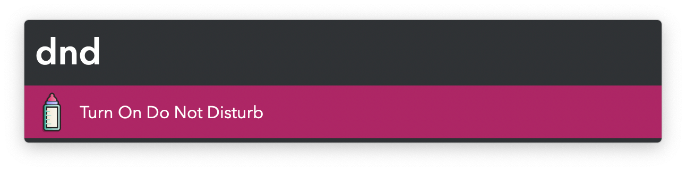
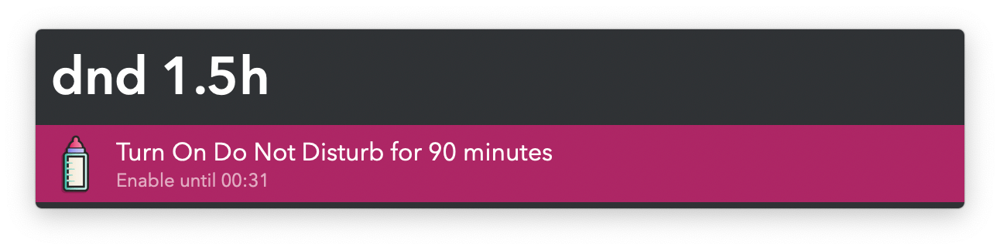
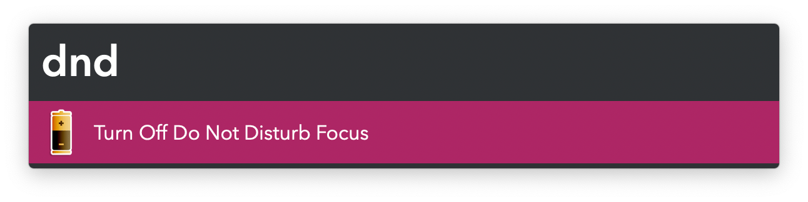

#  Calm Notifications Alfred Workflow

Toggle Do Not Disturb Focus Mode

<a href='https://alfred.app/workflows/vitor/calm-notifications'>⤓ Install From the Alfred Gallery</a>

## Usage

Toggle your Focus Mode via the Do Not Disturb Keyword (default: `dnd`). Optionally give a number when enabling to activate it for that amount of minutes, or hours if an `h` is appended.

